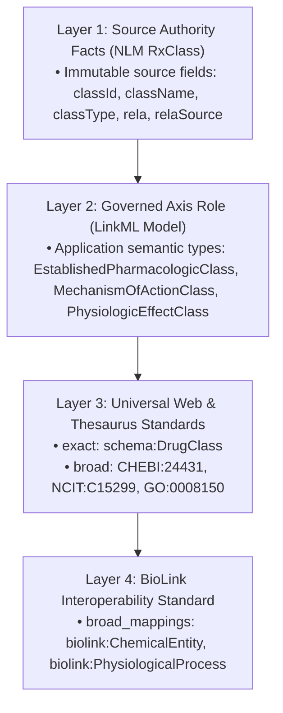

# Architecture Exploration & POC: Standards-Based Representation of Pharmacologic Classes & Qualifiers (Dual LPG + RDF)

**Document Type:** Technical Working Group (TWG) Reference Architecture & POC Candidate Specification  
**Revision:** 6.2 (Candidate Reference Specification — Ready for TWG Endorsement Decision)  
**Date:** August 29, 2026  
**Status:** READY FOR TWG CONDITIONAL ENDORSEMENT  
**Domain:** Real-World Data Knowledge Network (`rwdkn`) / NLM-KN Knowledge Graph  
**Audience:** Technical Working Group (TWG), Ontologists, Knowledge Graph Architects, Contractor Teams (K3)  

---

## 1. Executive Summary & Objectives

This document provides the **candidate reference architecture and Proof of Concept (POC) specification** for representing **Drugs**, **FDA Pharmacologic Classes**, **Mechanisms of Action (MoA)**, **Physiologic Effects (PE)**, and **Pharmacokinetics (PK)** across the NLM Knowledge Network ecosystem.

### Core Objectives
1. **Layered Semantics:** Maximize reuse of authoritative external standards (BioLink 4.3.6, NLM MED-RT, Schema.org, ChEBI, GO, NCIt) while preserving raw NLM RxClass source facts.
2. **Dual-Graph Parity (Testable POC Target):** Define a unified LinkML data model that deterministically compiles to both **Neo4j Labeled Property Graphs (Cypher)** and **Apache Jena Fuseki Triplestores (SPARQL 1.1)** with testable field-by-field parity tracked via automated CI acceptance gates.
3. **Lossless Contract Migration:** Provide a complete 23-column KGX Epoch-3 wire contract extension with fail-closed validation, lossless downgrade/rollback testing, and mismatch rejection.

---

## 2. Layered Semantic Mapping Policy

To avoid the pitfalls of an exclusionary waterfall, the architecture adopts a **Layered Semantic Mapping Policy** where source facts, application roles, web standards, and high-level categories complement each other:



---

## 3. Normative Ontology-Class Taxonomy Policy (with Explicit OWL 2 Punning)

To strictly satisfy the domain and range constraints of **BioLink 4.3.6 `biolink:subclass_of`** (`ontology class` $\rightarrow$ `ontology class`) and standard RDFS reasoning:

* **Taxonomic Hierarchy (`rdfs:subClassOf`):**
  * In the RWDKN Knowledge Graph, drug concepts (`rxnorm:1991302`) and pharmacologic classes (`medrt:N0000178480`) participate in class-level taxonomies via **`biolink:subclass_of`**, which compiles directly to **`rdfs:subClassOf`** in the RDFS rule reasoner.
* **Explicit Metamodeling / Punning Declarations (W3C OWL 2 Section F.12):**
  * Both resources are explicitly declared as **`owl:Class`** (for taxonomic hierarchy) and **`owl:NamedIndividual`** (for instance annotations and property-graph metadata). Class-side entailments and individual-side metadata remain semantically separate without violating OWL 2 DL profile consistency.

---

## 4. Terminology & Mapping Registry (Manually Verified for POC)

The external concept mappings below have been manually verified against authoritative EVS and OBO registries for this POC:

| Concept / Role | Pinned CURIE | Authoritative Concept Label | Ontology Authority | Mapping Strength |
|---|---|---|---|---|
| **Drug Class (Web Generic)** | `schema:DrugClass` | DrugClass | Schema.org Community | `exact_mappings` |
| **Chemical Structure Root** | `CHEBI:24431` | chemical entity | ChEBI | `broad_mappings` |
| **Biological Process Root** | `GO:0008150` | biological_process | Gene Ontology (GO) | `broad_mappings` |
| **Pharmacokinetics** | `NCIT:C15299` | Pharmacokinetics | NCI Thesaurus (NCIt) | `broad_mappings` |
| **BioLink Chemical Entity** | `biolink:ChemicalEntity` | chemical entity | BioLink Model 4.3.6 | `broad_mappings` |
| **BioLink Physiologic Process** | `biolink:PhysiologicalProcess` | physiological process | BioLink Model 4.3.6 | `broad_mappings` |

---

## 5. RWDKN Selected Pharmacologic Projection (NLM RxClass Ground Truth)

Using the official NLM RxClass response for **Semaglutide (`RXCUI:1991302`)**, here is the exact separation between **Immutable Source Facts** and **Normalized RWDKN Projections**:

| Axis Code | Exact Source Fact (NLM RxClass API) | Normalized Projection (RWDKN Knowledge Graph) |
|---|---|---|
| **EPC** | `classId`: `N0000178480`<br/>`className`: `"GLP-1 Receptor Agonist"`<br/>`classType`: `"EPC"`<br/>`rela`: `"has_epc"`<br/>`relaSource`: `"FDASPL"` | **Node Type:** `schema:DrugClass`, `biolink:ChemicalEntity`<br/>**LinkML Class:** `EstablishedPharmacologicClass`<br/>**Predicate:** `biolink:subclass_of`<br/>**Display Label:** `"GLP-1 Receptor Agonist [EPC]"` |
| **MOA** | `classId`: `N0000020058`<br/>`className`: `"Glucagon-like Peptide-1 (GLP-1) Agonists"`<br/>`classType`: `"MOA"`<br/>`rela`: `"has_moa"`<br/>`relaSource`: `"FDASPL"` | **Node Type:** `schema:DrugClass`, `biolink:ChemicalEntity`<br/>**LinkML Class:** `MechanismOfActionClass`<br/>**Predicate:** `biolink:subclass_of`<br/>**Display Label:** `"Glucagon-like Peptide-1 (GLP-1) Agonists [MoA]"` |
| **CHEM** | `classId`: `D052216`<br/>`className`: `"Glucagon-Like Peptide 1"`<br/>`classType`: `"CHEM"`<br/>`rela`: `"has_chemical_structure"`<br/>`relaSource`: `"FDASPL"` | **Node Type:** `CHEBI:24431`, `biolink:ChemicalEntity`<br/>**LinkML Class:** `ChemicalIngredientClass`<br/>**Predicate:** `biolink:subclass_of`<br/>**Display Label:** `"Glucagon-Like Peptide 1 [CHEM]"` |
| **ATC** | `classId`: `A10BJ`<br/>`className`: `"Glucagon-like peptide-1 (GLP-1) analogues"`<br/>`classType`: `"ATC1-4"`<br/>`rela`: `""` *(empty in source)*<br/>`relaSource`: `"ATC"` | **Node Type:** `biolink:ChemicalEntity`<br/>**LinkML Class:** `AtcClass`<br/>**Predicate:** `biolink:subclass_of`<br/>**Display Label:** `"Glucagon-like peptide-1 (GLP-1) analogues [ATC]"` |
| **PE** | `classId`: `N0000008640`<br/>`className`: `"Decreased Gastric Motility"`<br/>`classType`: `"PE"`<br/>`rela`: `"has_pe"`<br/>`relaSource`: `"MEDRT"` | **Node Type:** `biolink:PhysiologicalProcess`<br/>**LinkML Class:** `PhysiologicEffectClass`<br/>**Predicate:** `biolink:affects`<br/>**Display Label:** `"Decreased Gastric Motility [PE]"` |

> **Critical Ontological Boundary (MoA vs. PE):**
> * **`MoA` (Mechanism of Action Class)**: Groups **physical substances/chemicals** that act on a target. Classified as `biolink:ChemicalEntity` / `schema:DrugClass`.
> * **`PE` (Physiologic Effect)**: Represents a **biological process/event** in the body. Classified as `biolink:PhysiologicalProcess`, NOT a chemical entity.
> * **PE Directionality Rule:** Because `MEDRT:N0000008640` is *intrinsically directional* (*"Decreased Gastric Motility"*), edge qualifiers are omitted to prevent double-encoding.

---

## 6. Scope of Pharmacokinetics (PK)

* **Current Status in Epoch 2/3:** Qualitative and quantitative PK ingestion remains an explicit **future POC evaluation target** and is excluded from active pharmacologic class transforms.
* **Observation Model Separation:** When implemented, quantitative PK observations (Half-life = 168h, AUC ratio = 2.1x, Clearance = 0.05 L/h/kg) will use a dedicated **Observation Model** with numerical values and UCUM units, rather than flattening into edge qualifiers.

---

## 7. Dual Graph Implementation (Illustrative Reference Fixtures)

### 7.1 Field-by-Field Parity Table

| Field Name | Labeled Property Graph (Neo4j LPG) | Semantic Web (Apache Jena Fuseki RDF) | LinkML Semantic Range |
|---|---|---|---|
| **Subject Node ID** | `d.id = "RXCUI:1991302"` | `rxnorm:1991302` | `uriorcurie` |
| **Subject Category** | `d.category = "...|Drug|ChemicalEntity|..."` | `a owl:Class, owl:NamedIndividual, biolink:Drug` | `biolink:category` |
| **Object Node ID** | `epc.id = "MEDRT:N0000178480"` | `medrt:N0000178480` | `uriorcurie` |
| **Object Types** | `epc.class_type = "EPC"` | `a owl:Class, owl:NamedIndividual, schema:DrugClass` | `ClassAxisEnum` |
| **Predicate** | `r.predicate = "biolink:subclass_of"` | `biolink:predicate biolink:subclass_of` | `biolink:predicate` |
| **Source Relation** | `r.relation = "has_epc"` | `rwdkn:source_relation "has_epc"` | `string` |
| **Relation Source** | `r.relation_source = "FDASPL"` | `rwdkn:relation_source "FDASPL"` | `string` |
| **Primary Source** | `r.primary_knowledge_source = "infores:dailymed"` | `biolink:primary_knowledge_source infores:dailymed` | `infores:curie` |
| **Retrieval Proxy** | `r.knowledge_source = "infores:rxnorm"` | `biolink:knowledge_source infores:rxnorm` | `infores:curie` |
| **Aggregator** | `r.aggregator_knowledge_source = "https://w3id.org/rwdkn/infores/rwdkn"` | `biolink:aggregator_knowledge_source <https://w3id.org/rwdkn/infores/rwdkn>` | `uriorcurie` |

*Note on Retrieval Proxy Governance:* In this candidate specification, `infores:rxnorm` is documented as the proposed interim retrieval proxy for NLM RxNav/RxClass, with an explicit exit condition to migrate to `infores:rxclass` upon formal registry addition.

---

### 7.2 Labeled Property Graph (LPG / Neo4j Cypher)

```cypher
// 1. Create Nodes with Materialized Multi-Labels
CREATE (d:KGXNode:Drug:ChemicalEntity:NamedThing {
    id: 'RXCUI:1991302',
    name: 'Semaglutide',
    category: 'biolink:Drug|biolink:ChemicalEntity|biolink:NamedThing'
})

CREATE (epc:KGXNode:DrugClass:ChemicalEntity:NamedThing {
    id: 'MEDRT:N0000178480',
    name: 'GLP-1 Receptor Agonist [EPC]',
    category: 'biolink:ChemicalEntity|biolink:NamedThing',
    class_type: 'EPC'
})

CREATE (pe:KGXNode:PhysiologicalProcess:BiologicalProcess:NamedThing {
    id: 'MEDRT:N0000008640',
    name: 'Decreased Gastric Motility [PE]',
    category: 'biolink:PhysiologicalProcess|biolink:BiologicalProcess|biolink:NamedThing',
    class_type: 'PE'
})

// 2. Create Directed Relationships with Exact Source Facts & Complete Provenance
CREATE (d)-[:SUBCLASS_OF {
    predicate: 'biolink:subclass_of',
    relation: 'has_epc',
    relation_source: 'FDASPL',
    primary_knowledge_source: 'infores:dailymed',
    knowledge_source: 'infores:rxnorm',
    aggregator_knowledge_source: 'https://w3id.org/rwdkn/infores/rwdkn'
}]->(epc)

CREATE (d)-[:AFFECTS {
    predicate: 'biolink:affects',
    relation: 'has_pe',
    relation_source: 'MEDRT',
    primary_knowledge_source: 'infores:medrt-umls',
    knowledge_source: 'infores:rxnorm',
    aggregator_knowledge_source: 'https://w3id.org/rwdkn/infores/rwdkn'
}]->(pe)
```

---

### 7.3 Semantic Web (RDF / Apache Jena Fuseki Turtle Fixture)

```turtle
@prefix :        <https://w3id.org/rwdkn/resource/> .
@prefix rdf:     <http://www.w3.org/1999/02/22-rdf-syntax-ns#> .
@prefix rdfs:    <http://www.w3.org/2000/01/rdf-schema#> .
@prefix owl:     <http://www.w3.org/2002/07/owl#> .
@prefix schema:  <http://schema.org/> .
@prefix medrt:   <http://purl.bioontology.org/ontology/MEDRT/> .
@prefix rxnorm:  <http://purl.bioontology.org/ontology/RXNORM/> .
@prefix biolink: <https://w3id.org/biolink/vocab/> .
@prefix ncit:    <http://purl.obolibrary.org/obo/NCIT_> .
@prefix rwdkn:   <https://w3id.org/rwdkn/model/> .
@prefix dcterms: <http://purl.org/dc/terms/> .

# --- 1. Direct Concept Assertions (RDFS Taxonomy & Explicit OWL 2 Punning) ---
rxnorm:1991302
    a owl:Class, owl:NamedIndividual, biolink:Drug, biolink:ChemicalEntity ;
    rdfs:label "Semaglutide" ;
    rdfs:subClassOf medrt:N0000178480 ;
    biolink:subclass_of medrt:N0000178480 ;
    biolink:affects medrt:N0000008640 .

medrt:N0000178480
    a owl:Class, owl:NamedIndividual, schema:DrugClass, biolink:ChemicalEntity ;
    rdfs:label "GLP-1 Receptor Agonist [EPC]" ;
    rwdkn:class_type "EPC" ;
    rdfs:isDefinedBy <http://purl.bioontology.org/ontology/MEDRT> .

medrt:N0000008640
    a owl:NamedIndividual, biolink:PhysiologicalProcess ;
    rdfs:label "Decreased Gastric Motility [PE]" ;
    rwdkn:class_type "PE" .

# --- 2. Fully Reified Associations with Complete Field Parity ---
:assoc_semaglutide_epc
    a biolink:Association ;
    biolink:subject rxnorm:1991302 ;
    biolink:predicate biolink:subclass_of ;
    biolink:object medrt:N0000178480 ;
    rwdkn:source_relation "has_epc" ;
    rwdkn:relation_source "FDASPL" ;
    biolink:primary_knowledge_source <https://w3id.org/biolink/infores/dailymed> ;
    biolink:knowledge_source <https://w3id.org/biolink/infores/rxnorm> ;
    biolink:aggregator_knowledge_source <https://w3id.org/rwdkn/infores/rwdkn> .

:assoc_semaglutide_pe
    a biolink:Association ;
    biolink:subject rxnorm:1991302 ;
    biolink:predicate biolink:affects ;
    biolink:object medrt:N0000008640 ;
    rwdkn:source_relation "has_pe" ;
    rwdkn:relation_source "MEDRT" ;
    biolink:primary_knowledge_source <https://w3id.org/biolink/infores/medrt-umls> ;
    biolink:knowledge_source <https://w3id.org/biolink/infores/rxnorm> ;
    biolink:aggregator_knowledge_source <https://w3id.org/rwdkn/infores/rwdkn> .
```

---

## 8. Capabilities Matrix across Implementation Phases

| Architectural Feature | Current Baseline (Epoch 2) | Proposed POC Target (Epoch 3) | Future Serving Layer |
|---|---|---|---|
| **Data Specification** | LinkML `0.6.0` (`rwdkn-model.yaml`) | LinkML `0.7.0` (with discrete qualifier slots) | LinkML compiled to OWL 2 DL |
| **KGX Column Schema** | 20 Node cols / 19 Edge cols | 20 Node cols / 23 Edge cols (+4 columns) | Parquet / Graph Stores |
| **Qualifier Representation** | Encoded in pipe-delimited `qualifications` | First-class columns + lossless fallback | Native Edge Properties / RDF Reification |
| **LPG Storage (Neo4j)** | Materialized multi-labels | Materialized multi-labels + indexed qualifiers | Clustered Neo4j with APOC algorithms |
| **RDF Serving (Fuseki)** | Local N-Triples + pySHACL | Validated Turtle + reified `biolink:Association` | Persistent Fuseki TDB2 with RDFS rule reasoning |
| **Dual Parity Status** | Controlled manual alignment | **Automated round-trip test target** | Continuous CI/CD Parity Gate |

---

## 9. Appendix: Exact Epoch-3 KGX Edge Contract & Lossless Migration Specification

### 9.1 The 23-Column Physical TSV Contract
Extending `export_kgx.py:1570-1576` without dropping existing fields:

| Col # | Column Name | Epoch Status | Semantic Range | Wire Encoding (Physical TSV) | Description |
|---|---|---|---|---|---|
| 1 | `id` | Retained | `string` | `string` | Unique edge CURIE |
| 2 | `subject` | Retained | `uriorcurie` | `string` | Subject node identifier |
| 3 | `predicate` | Retained | `biolink:predicate` | `string` | Normalized BioLink predicate |
| 4 | `object` | Retained | `uriorcurie` | `string` | Object node identifier |
| 5 | `relation` | Retained | `string` | `string` | Raw source relation label (`has_epc`, `has_pe`) |
| 6 | **`relation_source`** | **NEW (Epoch 3)** | `string` | `string` (`""` \| authority label) | Authority that asserted the relation (`FDASPL`, `MEDRT`, `ATC`, `DAILYMED`, etc.) |
| 7 | **`qualified_predicate`** | **NEW (Epoch 3)** | `biolink:predicate` | `string` (`""` \| `curie`) | Optional predicate refinement from pinned BioLink 4.3.6 |
| 8 | **`object_aspect_qualifier`** | **NEW (Epoch 3)** | `AspectEnum` | `string` (`""` \| enum literal) | Pinned BioLink 4.3.6 `GeneOrGeneProductOrChemicalEntityAspectEnum` |
| 9 | **`object_direction_qualifier`** | **NEW (Epoch 3)** | `DirectionEnum` | `string` (`""` \| `increased` \| `decreased`...) | Pinned BioLink 4.3.6 `DirectionQualifierEnum` |
| 10 | `primary_knowledge_source` | Retained | `infores:curie` | `string` | Authoritative source (`infores:dailymed`, `infores:medrt-umls`) |
| 11 | `aggregator_knowledge_source` | Retained | `uriorcurie` | `string` | Pipeline aggregator (`https://w3id.org/rwdkn/infores/rwdkn`) |
| 12 | `knowledge_source` | Retained | `infores:curie` | `string` | Retrieval service proxy (`infores:rxnorm` proposed for POC) |
| 13 | `knowledge_level` | Retained | `KnowledgeLevelEnum` | `string` | `knowledge_assertion`, `statistical_association` |
| 14 | `agent_type` | Retained | `AgentTypeEnum` | `string` | `manual_agent`, `automated_agent` |
| 15 | `publications` | Retained | `list[uriorcurie]` | `string` (pipe-delimited) | Pipe-delimited PMIDs / SPL IDs |
| 16 | `has_evidence` | Retained | `uriorcurie` | `string` | Evidence identifier |
| 17 | `sentence_id` | Retained | `string` | `string` | Sentence provenance identifier |
| 18 | `triple_id` | Retained | `string` | `string` | Extracted assertion identifier |
| 19 | `source_section` | Retained | `string` | `string` | SPL LOINC section code |
| 20 | `negated` | Retained | `boolean` | `string` (`""` \| `"true"` \| `"false"`) | Negation flag |
| 21 | `qualifications` | Retained (Fallback) | `string` | `string` (pipe-delimited key=value) | Lossless pipe-delimited fallback string |
| 22 | `assertion_source` | Retained | `string` | `string` | Parser / rule identifier |
| 23 | `evidence_grounding_score` | Retained | `float` [0.0 - 1.0] | `string` (`""` \| decimal string) | Evidence confidence score |

---

### 9.2 Operational Migration, Validation & Lossless Downgrade Rules

1. **Exact Header Validation & Manifest Agreement:** Ingest loaders validate that the header matches the exact ordered 23-column array and agrees with `manifest.json` declaring `kgx_epoch: 3`. Header length mismatches or column name order deviations trigger immediate fail-closed termination.
2. **Lossless Dual-Write Rule:** During the migration window, exporters populate discrete columns 6–9 AND serialize all four fields into `qualifications` (Col 21) as `relation_source=<val>|qualified_predicate=<val>|object_aspect_qualifier=<val>|object_direction_qualifier=<val>`. This guarantees 100% lossless downgrade if reading via an Epoch-2 loader.
3. **Equality Validation & Mismatch Rejection:** When both discrete columns and a fallback `qualifications` string are present, loaders execute a strict equality check. Any discrepancy between discrete values and fallback key-values results in a fail-closed validation rejection.
4. **Discrete Type Validators:**
   * `qualified_predicate`: Validated against pinned BioLink 4.3.6 predicate CURIEs (or `""`).
   * `object_aspect_qualifier`: Validated against pinned `GeneOrGeneProductOrChemicalEntityAspectEnum` (or `""`).
   * `object_direction_qualifier`: Validated against pinned `DirectionQualifierEnum` (or `""`).
   * `relation_source`: Validated against governed authority vocabulary (`FDASPL`, `MEDRT`, `ATC`, `DAILYMED`, `RXNORM`, `UMLS`, or `""`).
5. **Lossless Downgrade Test Gate:** When implemented, the primary downgrade test **must be verified by automated CI** following the `Epoch-3 -> Epoch-2 -> Epoch-3` path (seeded with non-empty values across all four new fields: `relation_source`, `qualified_predicate`, `object_aspect_qualifier`, `object_direction_qualifier`), alongside an `Epoch-2 -> Epoch-3 -> Epoch-2` backward compatibility fixture.
