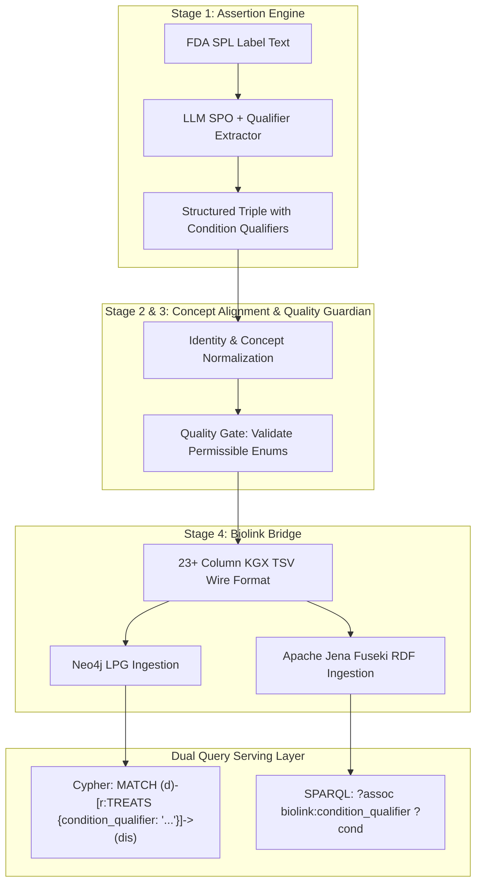

# Architecture Specification & Engineering Plan: Discrete Graph Conditionality & Context Qualifiers (Closing ISSUE-9 / CQ-5)

**Document ID:** `RWDKN-SPEC-2026-08-30-CQ5`  
**Date:** August 30, 2026  
**Status:** PROPOSED (Targeted for Epoch-4)  
**Authors:** Architecture & Data Pipeline Working Group  
**Target Capabilities:** Competency Question 5 (CQ-5: Conditional & Adjunct Indications), Structured Context Qualifiers, BioLink 4.3.6 Alignment, Dual-Graph Topology (Neo4j LPG + Apache Jena Fuseki RDF)

---

## 1. Executive Summary & Problem Statement

### 1.1. The Challenge (CQ-5 & ISSUE-9)
Competency Question 5 (CQ-5) requires answering precise clinical context questions, such as:
> *"Which drugs are indicated specifically as an **adjunct to diet and exercise** for glycemic control in Type 2 Diabetes Mellitus versus as monotherapy?"*

In the current **Epoch-3** architecture:
* **Evidence Preservation (100% Captured)**: The raw text `"indicated as an adjunct to diet and exercise to improve glycemic control..."` is preserved in PostgreSQL (`triple_provenance.evidence`) and carried in the KGX edge property `has_evidence`.
* **Graph Structure Gap (ISSUE-9)**: The graph relationship itself is an unconditioned triple `(Semaglutide)-[:TREATS]->(Type 2 Diabetes)`. A consumer cannot perform pure structured topology filtering or graph pattern matching (e.g. `WHERE r.condition_qualifier = 'adjunct_to_diet_and_exercise'`) without falling back to text regex search on the evidence string.

### 1.2. The Objective
Elevate conditionality from **unstructured evidence text** to **first-class discrete graph qualifiers** across LinkML, KGX wire formats, Neo4j property graphs, and Fuseki RDF associations.

---

## 2. Evidence Ground Truth (Live Database Baseline)

Live extractions in PostgreSQL (`lab_db`) demonstrate clear, recurring conditionality patterns across drug labels:

| Drug (Subject) | Direct Predicate | Clinical Object | Raw Evidence Sentence in `triple_provenance` | Extracted Conditionality Modifiers |
| :--- | :--- | :--- | :--- | :--- |
| **Semaglutide** (`RXCUI:1991302`) | `biolink:treats` | `SNOMEDCT:44054006` (T2D) | *"RYBELSUS and OZEMPIC tablets are indicated: **as an adjunct to diet and exercise** to improve glycemic control in adults with type 2 diabetes mellitus."* | `condition_qualifier`: `adjunct_to_diet_and_exercise`<br>`population_qualifier`: `adults` |
| **Tirzepatide** (`RXCUI:2601723`) | `biolink:treats` | `SNOMEDCT:44054006` (T2D) | *"MOUNJARO is indicated **as an adjunct to diet and exercise** to improve glycemic control in adults and pediatric patients 10 years of age and older..."* | `condition_qualifier`: `adjunct_to_diet_and_exercise`<br>`population_qualifier`: `adults_and_pediatrics_ge_10` |
| **Liraglutide** (`RXCUI:897122`) | `biolink:treats` | `SNOMEDCT:44054006` (T2D) | *"Liraglutide is indicated: **as an adjunct to diet and exercise** to improve glycemic control..."* | `condition_qualifier`: `adjunct_to_diet_and_exercise` |
| **Liraglutide / Degludec** | `biolink:treats` | `SNOMEDCT:44054006` (T2D) | *"XULTOPHY 100/3.6 is a combination of insulin degludec and liraglutide and is indicated **as an adjunct to diet and exercise**..."* | `condition_qualifier`: `adjunct_to_diet_and_exercise`<br>`combination_therapy`: `true` |

---

## 3. BioLink & LinkML Schema Modeling (Epoch-4 Design)

### 3.1. Discrete Qualifier Hierarchy
Following BioLink Model 4.3.6, we introduce four standardized qualifier slots on treatment and indication assertions:

```yaml
# Addition to subprojects/biolink-bridge/schema/rwdkn-model.yaml
slots:
  condition_qualifier:
    description: >-
      A qualifier specifying clinical or behavioral prerequisites for an indication,
      such as adjunct therapy (diet, exercise) or monotherapy requirements.
    range: ConditionQualifierEnum
    multivalued: false
    required: false

  population_qualifier:
    description: >-
      A qualifier specifying the target patient demographic (e.g. adults, pediatric_ge_10, geriatric).
    range: PopulationQualifierEnum
    multivalued: false
    required: false

  combination_therapy_qualifier:
    description: >-
      Indicates whether the drug must be administered in combination with another active agent or therapy.
    range: boolean
    required: false

  line_of_therapy_qualifier:
    description: >-
      Specifies if the indication is restricted to first-line, second-line, or refractory settings.
    range: string
    required: false

enums:
  ConditionQualifierEnum:
    permissible_values:
      adjunct_to_diet_and_exercise:
        description: Indicated as an adjunct to dietary modifications and physical exercise
        meaning: SNOMEDCT:429300007 # Lifestyle modification
      monotherapy:
        description: Indicated as a standalone single-agent regimen
      adjunct_to_standard_of_care:
        description: Indicated on top of established background disease therapy
      secondary_prevention:
        description: Indicated for prevention of subsequent clinical events
```

---

## 4. End-to-End Pipeline Implementation Architecture



### 4.1. Stage 1: Extraction Prompt Upgrades (`assertion-engine`)
Update the prompt extraction schema in `subprojects/assertion-engine/` to instruct the LLM to separate the direct clinical disease entity from its modifiers:

```json
{
  "subject": "Semaglutide",
  "predicate": "treats",
  "object": "Type 2 Diabetes Mellitus",
  "condition_qualifier": "adjunct_to_diet_and_exercise",
  "population_qualifier": "adults",
  "combination_therapy": false,
  "evidence_sentence": "RYBELSUS and OZEMPIC tablets are indicated: as an adjunct to diet and exercise to improve glycemic control in adults with type 2 diabetes mellitus."
}
```

### 4.2. Dual Storage Projections

#### A. Neo4j LPG Projection
Edges are materialized with discrete property keys:
```cypher
(:Drug {id: 'RXCUI:1991302', name: 'semaglutide'})
  -[:TREATS {
      id: 'urn:uuid:assoc-101',
      relation: 'RO:0002606',
      condition_qualifier: 'adjunct_to_diet_and_exercise',
      population_qualifier: 'adults',
      source_section: '34084-4',
      has_evidence: 'RYBELSUS and OZEMPIC tablets are indicated: as an adjunct to diet and exercise...'
  }]->
  (:Disease {id: 'SNOMEDCT:44054006', name: 'Type 2 diabetes mellitus'})
```

#### B. Apache Jena Fuseki RDF Projection
Projected via W3C OWL 2 / BioLink reified associations:
```turtle
@prefix biolink: <https://w3id.org/biolink/vocab/> .
@prefix rwdkn:   <https://w3id.org/realkg/> .

<urn:uuid:assoc-101> a biolink:ChemicalToDiseaseOrPhenotypicFeatureAssociation ;
    biolink:subject <https://mor.nlm.nih.gov/RxNav/search?searchBy=RXCUI&searchTerm=1991302> ;
    biolink:predicate biolink:treats ;
    biolink:object <http://snomed.info/id/44054006> ;
    rwdkn:condition_qualifier "adjunct_to_diet_and_exercise" ;
    rwdkn:population_qualifier "adults" ;
    biolink:has_evidence "RYBELSUS and OZEMPIC tablets are indicated: as an adjunct to diet and exercise..." .
```

---

## 5. Competency Questions Benchmark (CQ-5 Query Validation)

### 5.1. Target Cypher Query (Neo4j)
```cypher
// CQ-5: Find all GLP-1 receptor agonist drugs indicated as adjunct to diet and exercise for Type 2 Diabetes
MATCH (drug:Drug)-[:SUBCLASS_OF]->(class:DrugClass {name: 'GLP-1 Receptor Agonists [EPC]'})
MATCH (drug)-[r:TREATS {condition_qualifier: 'adjunct_to_diet_and_exercise'}]->(dis:Disease {id: 'SNOMEDCT:44054006'})
RETURN drug.name AS drug_name, 
       r.condition_qualifier AS condition,
       r.population_qualifier AS target_population,
       r.has_evidence AS clinical_evidence;
```

### 5.2. Target SPARQL Query (Fuseki RDF)
```sparql
PREFIX biolink: <https://w3id.org/biolink/vocab/>
PREFIX rwdkn:   <https://w3id.org/realkg/>
PREFIX rdfs:    <http://www.w3.org/2000/01/rdf-schema#>

SELECT ?drugName ?condition ?evidence WHERE {
    ?drug rdfs:subClassOf <http://purl.bioontology.org/ontology/MEDRT/N0000175570> ;
          biolink:name ?drugName .
    ?assoc a biolink:ChemicalToDiseaseOrPhenotypicFeatureAssociation ;
           biolink:subject ?drug ;
           biolink:predicate biolink:treats ;
           biolink:object <http://snomed.info/id/44054006> ;
           rwdkn:condition_qualifier ?condition ;
           biolink:has_evidence ?evidence .
    FILTER (?condition = "adjunct_to_diet_and_exercise")
}
```

---

## 6. Implementation Roadmap & Milestones

| Phase | Component | Tasks | Target Outcome |
| :--- | :--- | :--- | :--- |
| **Phase 1** | **Schema & Contracts** | Add `condition_qualifier` and `population_qualifier` to `rwdkn-model.yaml` & `field-lineage.yaml`. | LinkML model v0.8.0 with regenerated JSON schemas. |
| **Phase 2** | **Extraction Stage 1** | Enhance extraction prompts in `assertion-engine` to parse adjunct/lifestyle clauses into discrete JSON keys. | Test against 12 DailyMed labels and verify qualifier extraction. |
| **Phase 3** | **Export & Gate** | Update `export_kgx.py` wire serialization and `quality-guardian` validator to enforce permissible enum values. | 100% gate pass on test fixtures with discrete qualifiers. |
| **Phase 4** | **Dual Projections** | Update `load_kgx_to_neo4j.py` and `rdf_projection.py` to project discrete condition properties. | Automated dual-store parity tests executing CQ-5 queries in Cypher and SPARQL. |

---

## 7. Status & Tracking

* **Architecture Document**: `kg-docs/architecture/2026-08-30-cq5-conditionality-and-qualifier-architecture.md`
* **Data Pipeline Mirror**: `rwdkn-data-pipeline/docs/2026-08-30-cq5-conditionality-and-qualifier-architecture.md`
* **Issue Registry**: Closes `ISSUE-9` and resolves `CQ-5` on the system roadmap.
