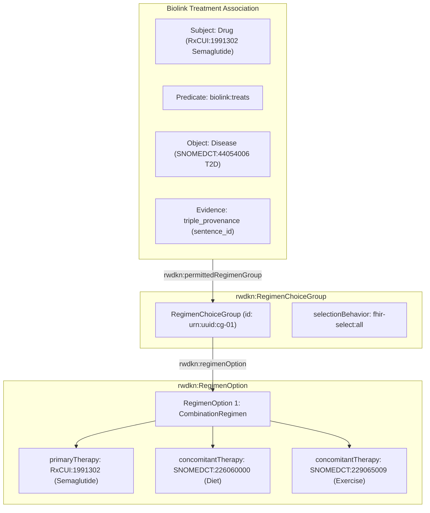

# Implementation Plan: Standards-Aligned Regimen Choice Architecture for CQ-5 (ISSUE-9)

**Document ID:** `RWDKN-PLAN-2026-08-30-CQ5-REV1`  
**Date:** August 30, 2026  
**Status:** PROPOSED FOR REVIEW (No code executed yet)  
**Related Documents:**  
* Reviewer Feedback: [`2026-08-30-cq5-regimen-choice-group-feedback.md`](file:///home/chandrakola/development/NLM/kg/kg-docs/architecture/2026-08-30-cq5-regimen-choice-group-feedback.md)  
* Target Capability: Competency Question 5 (CQ-5: Conditional & Adjunct Indications, ISSUE-9)  
* Target Repositories: `rwdkn-data-pipeline`, `rwdkn-service`, `kg-docs`  

---

## 1. Executive Summary & Goals

### 1.1. Problem Statement
Competency Question 5 (CQ-5) requires answering precise clinical conditionality queries:
> *"Which drugs are indicated specifically as an **adjunct to diet and exercise** for glycemic control in Type 2 Diabetes Mellitus versus as monotherapy or combination therapy?"*

While PostgreSQL (`triple_provenance.evidence`) and KGX (`has_evidence`) preserve 100% of the raw sentence text, current graph relationships represent unconditioned edges: `(Semaglutide)-[:TREATS]->(Type 2 Diabetes)`. Consumers cannot filter on conditionality using pure graph structure without falling back to string regex search on the evidence text.

### 1.2. Adopted Architecture
This plan adopts the standards-aligned **`RegimenChoiceGroup` + `RegimenOption`** model. It replaces brittle composite string enums (`adjunct_to_diet_and_exercise`, `adjunct_to_radiotherapy`) with a compositional, standards-grounded architecture reusing:
* **HL7 FHIR `action-selection-behavior`** (`exactly-one`, `all`, `one-or-more`, `all-or-none`) for selection logic.
* **HL7 FHIR `therapy-relationship-type`** (`indicated-only-with`, `contraindicated-with`) for indication constraints.
* **BioLink Model 4.3.6** for core treatment associations.
* **SNOMED-CT & RxNorm** for non-drug and drug therapy identities.
* **W3C SHACL** for RDF graph structural validation.

---

## 2. Core Semantic Invariants

1. **Open-World Assumption (Absence $\ne$ Monotherapy)**:
   * A treatment assertion lacking a `RegimenChoiceGroup` represents **unspecified regimen information**, *never* monotherapy.
   * Monotherapy must be represented as an explicit, evidence-backed `ExplicitMonotherapy` or single-agent `RegimenOption`.
2. **Indivisible Regimen Bundles**:
   * Permitted combinations are grouped into distinct `RegimenOption` units (e.g. `Option 1: [A + B]`, `Option 2: [C + D]`). They must never be flattened into a single list (`{A, B, C, D}`) to prevent unauthorized cross-combinations.
3. **Terminology-Backed Therapies**:
   * All concomitant therapies (lifestyle, diet, exercise, drugs, surgery) must be grounded to standard CURIEs (`SNOMEDCT:429300007`, `SNOMEDCT:226060000`, `SNOMEDCT:229065009`, `RXCUI:...`), never free text.
4. **Dual-Store Parity (LPG vs. RDF)**:
   * Neo4j Cypher and Fuseki SPARQL must return identical canonical result sets for CQ-5 queries.

---

## 3. System Architecture & Schema Specification



---

## 4. Proposed Multi-Phase Implementation

### Phase 1: LinkML Schema, SHACL Shapes & Closed Contract Generation
**Target Repository:** `rwdkn-data-pipeline` (`subprojects/biolink-bridge/`)

#### 1.1. Update LinkML Model (`subprojects/biolink-bridge/schema/rwdkn-model.yaml`)
* Define new classes:
  * `RegimenChoiceGroup`: slots `[id, selection_behavior, regimen_options]`
  * `RegimenOption`: slots `[id, regimen_type, selection_behavior, primary_therapy, concomitant_therapies]`
  * `ProhibitedRegimen`: slots `[id, prohibited_therapies, prohibition_reason]`
* Define enums reusing FHIR ValueSets:
  * `ActionSelectionBehaviorEnum`: `[all, any, all_or_none, exactly_one, at_most_one, one_or_more]`
  * `TherapyRelationshipTypeEnum`: `[indicated_only_with, contraindicated_with, replaces, adjunct_to]`
  * `RegimenTypeEnum`: `[combination_regimen, explicit_monotherapy, prohibited_regimen]`

#### 1.2. Create SHACL Shape Definitions (`subprojects/biolink-bridge/resources/rwdkn-regimen-shapes.ttl`)
* Enforce structural validation rules:
  * Every `RegimenChoiceGroup` must have at least 1 `rwdkn:regimenOption`.
  * Every `RegimenOption` must declare `rwdkn:primaryTherapy`.
  * `CombinationRegimen` must declare $\ge 1$ `rwdkn:concomitantTherapy`.
  * `ExplicitMonotherapy` must declare 0 `rwdkn:concomitantTherapy`.

#### 1.3. Contract Regeneration
* Run `gen_contracts.py` to regenerate all 7 JSON schemas, validation IR, and `MANIFEST.json`.

---

### Phase 2: Stage 1 Assertion Extraction & Terminology Alignment
**Target Repository:** `rwdkn-data-pipeline` (`subprojects/assertion-engine/`, `subprojects/concept-align/`)

#### 2.1. Extraction Prompt Schema (`subprojects/assertion-engine/`)
* Update the structured LLM prompt in `assertion-engine` to output structured regimen objects alongside SPO triples:
  ```json
  {
    "subject": "Semaglutide",
    "predicate": "treats",
    "object": "Type 2 Diabetes Mellitus",
    "regimen": {
      "selection_behavior": "all",
      "options": [
        {
          "regimen_type": "combination",
          "concomitant_therapies": [
            {"name": "diet", "category": "Lifestyle"},
            {"name": "exercise", "category": "Lifestyle"}
          ]
        }
      ]
    },
    "evidence": "RYBELSUS and OZEMPIC tablets are indicated: as an adjunct to diet and exercise to improve glycemic control in adults with type 2 diabetes mellitus."
  }
  ```

#### 2.2. Terminology Normalization (`subprojects/concept-align/`)
* Ground lifestyle, dietary, and non-drug therapeutic terms to standard ontologies:
  * *Diet / Dietary modification* $\rightarrow$ `SNOMEDCT:226060000` (*Dietary education*) or `NCIT:C15250`
  * *Exercise / Physical activity* $\rightarrow$ `SNOMEDCT:229065009` (*Exercise therapy*) or `NCIT:C156760`
  * *Lifestyle modification* $\rightarrow$ `SNOMEDCT:429300007`
* Ground concomitant drugs to RxNorm / UNII (`RXCUI:...`).

---

### Phase 3: Wire Serialization & Quality Guardian Gates
**Target Repository:** `rwdkn-data-pipeline` (`subprojects/biolink-bridge/`, `subprojects/quality-guardian/`)

#### 3.1. KGX Wire Serialization (`export_kgx.py`)
* Maintain backward compatibility of `edges.tsv` while adding structured regimen serialization:
  * **Option A (Dual-Write in `qualifications`)**: Encode JSON payload `regimen_choice_group={"behavior":"all","options":[...]}` in the `qualifications` slot.
  * **Option B (Reified Edge Entities)**: Export `RegimenChoiceGroup` and `RegimenOption` as explicit nodes in `nodes.tsv` with connecting edges in `edges.tsv`.
* Update `export_manifest.json` and export profiles with regimen statistics.

#### 3.2. Quality Guardian Fail-Closed Gate (`validate_stage4_ontology.py`)
* Add validation checks ensuring:
  * `selection_behavior` matches permissible FHIR vocabulary.
  * Concomitant therapy CURIEs are valid and normalized.
  * Rejects ungrounded free-text therapies.

---

### Phase 4: Dual Serving Projections (Neo4j LPG + Apache Jena Fuseki RDF)
**Target Repository:** `rwdkn-data-pipeline` (`subprojects/biolink-bridge/`)

#### 4.1. Neo4j LPG Projection (`load_kgx_to_neo4j.py`)
* Materialize graph topology:
  ```cypher
  (:Drug {id: 'RXCUI:1991302', name: 'semaglutide'})
    -[:TREATS {id: 'urn:uuid:assoc-101', has_evidence: '...'}]->
    (:Disease {id: 'SNOMEDCT:44054006', name: 'Type 2 diabetes mellitus'})
  
  (:Association {id: 'urn:uuid:assoc-101'})
    -[:HAS_REGIMEN_CHOICE]->(:RegimenChoiceGroup {id: 'urn:uuid:rcg-01', selection_behavior: 'all'})
    -[:HAS_OPTION]->(:RegimenOption {id: 'urn:uuid:ro-01', regimen_type: 'combination'})
    -[:CONCOMITANT_THERAPY]->(:Therapy {id: 'SNOMEDCT:226060000', name: 'Dietary education'})
  ```
* Populate shortcut edge property `r.regimen_type = 'combination'` on the direct `TREATS` edge for fast query traversal.

#### 4.2. Apache Jena Fuseki RDF Projection (`rdf_projection.py`)
* Project canonical Turtle / N-Triples:
  ```turtle
  @prefix biolink:     <https://w3id.org/biolink/vocab/> .
  @prefix fhir-select: <http://hl7.org/fhir/action-selection-behavior/> .
  @prefix rwdkn:       <https://w3id.org/realkg/> .

  <urn:uuid:assoc-101> a biolink:ChemicalToDiseaseOrPhenotypicFeatureAssociation ;
      biolink:subject <https://mor.nlm.nih.gov/RxNav/search?searchBy=RXCUI&searchTerm=1991302> ;
      biolink:predicate biolink:treats ;
      biolink:object <http://snomed.info/id/44054006> ;
      rwdkn:permittedRegimenGroup <urn:uuid:rcg-01> ;
      biolink:has_evidence "RYBELSUS and OZEMPIC tablets are indicated: as an adjunct to diet and exercise..." .

  <urn:uuid:rcg-01> a rwdkn:RegimenChoiceGroup ;
      rwdkn:selectionBehavior fhir-select:all ;
      rwdkn:regimenOption <urn:uuid:ro-01> .

  <urn:uuid:ro-01> a rwdkn:RegimenOption ;
      rwdkn:regimenType rwdkn:CombinationRegimen ;
      rwdkn:primaryTherapy <https://mor.nlm.nih.gov/RxNav/search?searchBy=RXCUI&searchTerm=1991302> ;
      rwdkn:concomitantTherapy <http://snomed.info/id/226060000> ,
                               <http://snomed.info/id/229065009> .
  ```

---

### Phase 5: Automated Test Gates & CQ-5 Parity Harness
**Target Repository:** `rwdkn-data-pipeline` (`subprojects/biolink-bridge/tests/`)

#### 5.1. Unit & SHACL Tests
* `test_regimen_choice_shacl.py`: Validate generated RDF graph against `rwdkn-regimen-shapes.ttl` using `pyshacl`.
* `test_regimen_serialization.py`: Test round-trip export, serialization, and deserialization of single-agent, multi-agent, and nested regimen choices.

#### 5.2. Live Dual-Store Parity Gate (`test_cq5_dual_store_parity.py`)
* Execute parallel queries for Semaglutide (`RXCUI:1991302`), Tirzepatide (`RXCUI:2601723`), and Liraglutide (`RXCUI:897122`):
  * **Cypher Query**:
    ```cypher
    MATCH (d:Drug)-[r:TREATS]->(dis:Disease)
    MATCH (assoc:Association {id: r.id})-[:HAS_REGIMEN_CHOICE]->(rcg)-[:HAS_OPTION]->(opt)-[:CONCOMITANT_THERAPY]->(t:Therapy)
    RETURN d.name AS drug, dis.name AS indication, rcg.selection_behavior AS behavior, collect(t.name) AS concomitant
    ```
  * **SPARQL Query**:
    ```sparql
    PREFIX biolink: <https://w3id.org/biolink/vocab/>
    PREFIX rwdkn:   <https://w3id.org/realkg/>
    SELECT ?drug ?indication ?behavior (GROUP_CONCAT(?therapy; separator=", ") AS ?concomitant) WHERE {
        ?assoc a biolink:ChemicalToDiseaseOrPhenotypicFeatureAssociation ;
               biolink:subject ?d ;
               biolink:predicate biolink:treats ;
               biolink:object ?dis ;
               rwdkn:permittedRegimenGroup ?rcg .
        ?rcg rwdkn:selectionBehavior ?behavior ;
             rwdkn:regimenOption ?opt .
        ?opt rwdkn:concomitantTherapy ?t .
    } GROUP BY ?drug ?indication ?behavior
    ```
* Assert tuple-level equivalence of results between Neo4j and Fuseki.

---

## 5. Verification Plan & Review Checklist

### 5.1. Automated Test Verification
```bash
# 1. Regenerate contracts & check integrity
cd subprojects/biolink-bridge && uv run python gen_contracts.py --check

# 2. Run SHACL structural validation
uv run pytest tests/test_shacl_validation.py -v

# 3. Run full dual-store CQ-5 parity suite
uv run pytest tests/test_cq5_dual_store_parity.py -v

# 4. Run Quality Guardian validation gate
cd ../quality-guardian && uv run pytest tests/
```

### 5.2. Review Questions for Secondary AI Tool
When evaluating this implementation plan, the reviewing AI tool should assess:
1. **Standards Compliance**: Does the plan accurately adhere to HL7 FHIR `action-selection-behavior` and BioLink Association models?
2. **Open-World Correctness**: Is the rule *"missing group = unspecified (not monotherapy)"* strictly maintained across all stages?
3. **Combinatorial Integrity**: Does the `RegimenOption` bundling prevent illegitimate permutations of therapies?
4. **Dual-Store Realism**: Are the Cypher and SPARQL query models computationally efficient and mathematically equivalent?
5. **Terminology Rigor**: Are non-drug therapies adequately constrained to standard vocabularies (SNOMED-CT / NCIT / MeSH)?
